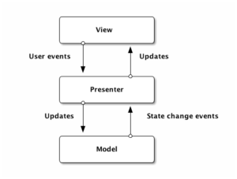
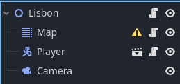

# A Brazilian Odissey

Game Design Document aqui...

# Model-View-Presenter em C#

Para mais detalhes sobre MVP (e suas diferenças em relação ao MVC), siga este ótimo artigo da Baeldung: https://www.baeldung.com/mvc-vs-mvp-pattern

## PT-BR

O diagrama abaixo mostra o controle de fluxo do padrão arquitetural MVP:



E você pode entendê-lo como:

1. Usuário interage com a View
2. Presenter é notificado sobre a interação
3. Presenter atualiza o estado do Model
4. Model retorna a mudança de estado para o Presenter
5. Presenter faz o display do Model alterado na View
6. Volta para o item 1

Mas como isso fica na prática em um jogo real na Godot Engine?

Se você navegar até [./src/game](./src/game), vai encontrar alguns pacotes/diretórios que implementam esse padrão, com alguma pequena adaptação.

Primeira adaptação é a criação da classe [SceneManager](./src/game/manager/SceneManager.cs). Essa seria a classe Main ou o index.js se fosse numa aplicação. É o Entry Point dessa Scene. Responsável por instanciar e injetar as dependências das Presenters:

```csharp
public override void _Ready()
{
    var camera = GetNode<Camera2D>("Camera");
    this.cameraService = new GodotCameraService(camera);

    this.playerView = GetNode<PlayerView>("Player");
    this.player = new Player("Leandro Vieira");
    var playerPresenter = new PlayerPresenter(this.cameraService, this.player, this.playerView);
    playerPresenter.Start();
    
    this.sceneView = GetNode<MapView>("Map");
    this.scene = new Map();
    var scenePresenter = new MapPresenter(this.cameraService, this.scene, this.sceneView);
    scenePresenter.Start();
}
```

Classes do tipo Manager serão associadas sempre ao Node root da Scene, nesse caso Lisbon:



Map e Player, os outros Nodes principais dessa Scene, terão, respectivamente, [GodotMapView](./src/game/view/GodotMapView.cs) e [GodotPlayerView](./src/game/view/GodotPlayerView.cs).

As classes Presenter, tanto [MapPresenter](./src/game/presenter/MapPresenter.cs) quanto [PlayerPresenter](./src/game/presenter/PlayerPresenter.cs), servem para orquestrar as ações de Map e Player oriundas das suas View.

### Player

### [View](./src/game/view/GodotPlayerView.cs)

Responsável pelas ações do Player, como por exemplo a movimentação (andar/correr/parar) e a animação.

### [Model](./src/game/model/Player.cs)

Responsável pelos atributos, estado e lógica de um Player.

### [Presenter](./src/game/presenter/PlayerPresenter.cs)

Responsável por orquestrar os Inputs da View e as mudanças de estado do Model, incluindo alterar a posição da câmera para posição atual do Player.

### Map

### [View](./src/game/view/GodotMapView.cs)

Responsável pelas ações do Mapa, como por exemplo o redimensionamento da tela.

### [Model](./src/game/model/Map.cs)

Responsável pelos atributos, estado e lógica de um Mapa.

### [Presenter](./src/game/presenter/MapPresenter.cs)

Responsável por orquestrar os Inputs da View e as mudanças de estado do Model, incluindo a definição dos limites da câmera quando ocorre um redimensionamento.

## CameraService

Como tanto a PlayerPresenter quanto a MapPresenter interagem com a câmera, CameraService serve para unificar ações em uma câmera. Player chama o método `UpdatePosition` de [GodotCameraService.cs](./src/game/service/GodotCameraService.cs), enquanto o Map chama o método `SetLimits` de [GodotCameraService.cs](./src/game/service/GodotCameraService.cs)
